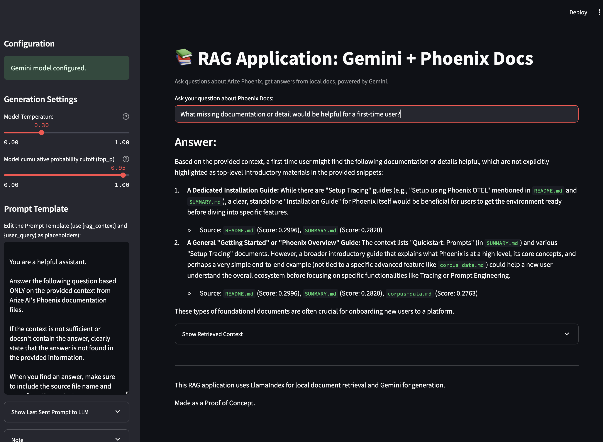

# Streamlit RAG Application with Gemini & Arize Phoenix Documentation

This application demonstrates a Retrieval Augmented Generation (RAG) setup using:
- Streamlit for the web interface.
- Google Gemini (via `google-generativeai`) as the generative model.
- An offline copy of the Arize Phoenix documentation (`dat/phx-docs/docs`) as the reference dataset.
- LlamaIndex for in-memory indexing and retrieval of the documentation.



## Features

- Queries local Arize Phoenix documentation.
- Uses Google's Gemini model for answer generation.
- In-memory vector index created by LlamaIndex using `sentence-transformers`.
- Adjustable LLM generation parameters (Temperature, Top-P) via the Streamlit sidebar.
- Editable prompt template for advanced customization, accessible in the sidebar.
- Displays the exact prompt sent to the LLM for transparency and debugging.

## Project Structure

```
.
├── bin/
│   └── run-rag-app         # Script to run the Streamlit application
├── dat/
│   └── phx-docs/           # Target directory for Phoenix documentation (populated by script)
│       └── docs/             # Markdown files for Phoenix
├── etc/
│   ├── localdev.env        # Template for environment variables (e.g., GOOGLE_API_KEY)
│   └── requirements.txt    # Python dependencies
├── sbin/
│   ├── clone-phx-docs      # Script to download/clone Phoenix documentation
│   ├── mkpyenv             # Script to create Python virtual environment & install deps
│   └── source-python-venv  # Helper to source the virtual environment (not directly run)
├── src/
│   └── app.py              # Main Streamlit application code
└── README.md               # This file
```

## Setup

1.  **Clone this repository (if you haven't already).**

2.  **Initialize the stack**
    The app depends on a simple python stack and having the Phoenix
    documentation on disk. 
    Running 
    ```bash
    ./sbin/init-full.sh
    ```
    will first download a sparse clone targeting `docs/` from the
    Phoenix GitHub (still about 500 MiB). 
    It then will set up a dedicated Python virtual environment
    (`venv-arize-ai-rag-app`) and install the required packages from
    `etc/requirements.txt`.

3.  **Set up your Google API Key:**
    It is recommended that you keep a local copy of your Gemini API key
    in `etc/localdev.env`. Doing so will streamline the RAG application
    experience, which otherwise requires copy-and-pasting your Key into
    the StreamLit U.I. every new runtime.
    -   Copy-then-modify or modify the `etc/.env` template if you plan to use a `.env` file:
        ```bash
        # cp etc/.env etc/localdev.env 
        ```
    -   Edit the `localdev.env` file and add your `GOOGLE_API_KEY`:
        ```
        GOOGLE_API_KEY="YOUR_ACTUAL_API_KEY_HERE"
        ```
    -   Alternatively, the application will prompt you to enter your
        Google API Key in the Streamlit sidebar if it is not found in
        the environment or Streamlit secrets.

## Running the Application

Use the provided script in the `bin/` directory to launch the Streamlit
application, without arguments.

```bash
./bin/run-rag-app [path to .env file, default: etc/localdev.env]
```

The script handles environment variables from `etc/localdev.env` by
default. It will load from a different file if the path is passed as an
argument, e.g., `.env`:
```bash
./bin/run-rag-app .env
```

So long as the stack was created successfully with
`./sbin/init-full.sh`, your default browser should automatically open to
the Streamlit-powered RAG app. Otherwise, navigate to the URL provided
by Streamlit (usually `http://localhost:8501`).  

If the API key was not loaded from the environment, enter it in the
sidebar.

## Development Notes

-   **Virtual Environment:** To activate the virtual environment manually for development (e.g., to run `pip freeze` or other tools):
    ```bash
    source venv-arize-ai-rag-app/bin/activate
    ```
    Alternatively, just run the required tool by specifying the path,
    e.g., `./venv-arize-ai-rag-app/bin/pip freeze`.
-   **Dependencies:** Key dependencies are listed in `etc/requirements.txt`. 
    `watchdog` is included for Streamlit's hot-reloading during development.
-   **LlamaIndex Indexing:** The Phoenix documentation is indexed in
    memory by LlamaIndex when the Streamlit app starts. This might take
    a few moments the first time or if the documents change
    significantly. 
    No significant latency was noticed in testing, on an M1 MacBook Pro.
-   For poor internet connections, `sbin/init-fast.sh` is provided,
    which forgoes the sparse `git clone` of the phoenix repo and instead
    uncompresses a zstandard tarball, `dat/phx-docs.md-only.tar.zst`, of
    only the markdown files in a snapshot of the Phoenix documentation
    (2025-05-07, [1][permalink]).  
    * That script makes use of `sbin/uncompress-phx-docs-md-only`, which
      should be portable across unix/linux systems. 
    * The original tarball was generated with
      `sbin/compress-phx-docs-md-only`, which is included in the
      repository in case future snapshots need to be made.
-   The rag app, `src/app.py` has several constants defined in its
    header that a developer should be aware of.
    * `DOCS_PATH = "dat/phx-docs/docs"`, references the RAG directory
      path. 
    * `EMBEDDING_MODEL_NAME = "sentence-transformers/all-MiniLM-L6-v2"`, 
      sentence transformers as a decent, and also common, middle ground
      to less semantic methods like Term Frequency-Inverse Document
      Frequency (TF-IDF), or more complex and direct usage of
      `transformers`, or significantly more costly API-based embeddings
      like `text-embedding-004`. The specific model 
      achieves good semantic similarity, is relatively small, and
      is computationally affordable even with CPUs, making it one of the
      more widely adopted embeddings. See also: [2][hugging face
      benchmarks].
    * `GEMINI_MODEL_NAME = 'gemini-2.5-pro-exp-03-25'`, these update
      frequently
    * `DEFAULT_PROMPT_TEMPLATE = """..."""` The default prompt for the
      RAG Q&A. 

## TODO / Future Enhancements

-   [ ] Explore options for persisting the LlamaIndex (FAISS, ChromaDB)
    to reduce startup time after initial indexing, especially for larger
    datasets.
-   [ ] Add more robust error handling for document loading and API
    interactions.
-   [ ] Allow for alternative models and handle multiple API keys.
-   [ ] Provide Q&A history UI.
-   [ ] Implement caching for Gemini responses for identical queries to
    save API calls and improve perceived speed (`st.cache_data` or
    `st.cache_resource`).
-   [ ] Allow user to select different embedding models or RAG
    parameters directly from the UI.
-   [ ] Improve UI/UX for displaying retrieved context (e.g.,
    highlighting, source navigation).
-   [ ] Consider adding support for other document types if Phoenix docs
    expand beyond Markdown.
-   [ ] Consider adding other documentation bases, to better analyze
    gaps.
-   [ ] Automate set of tests to barrage any new or modified
    documentation page with to increase quality and readability.


[1]: https://github.com/Arize-ai/phoenix/tree/1c1e49352eadbbf8be157cd99b1d36b23f884ba7/docs
[2]: https://huggingface.co/spaces/mteb/leaderboard
